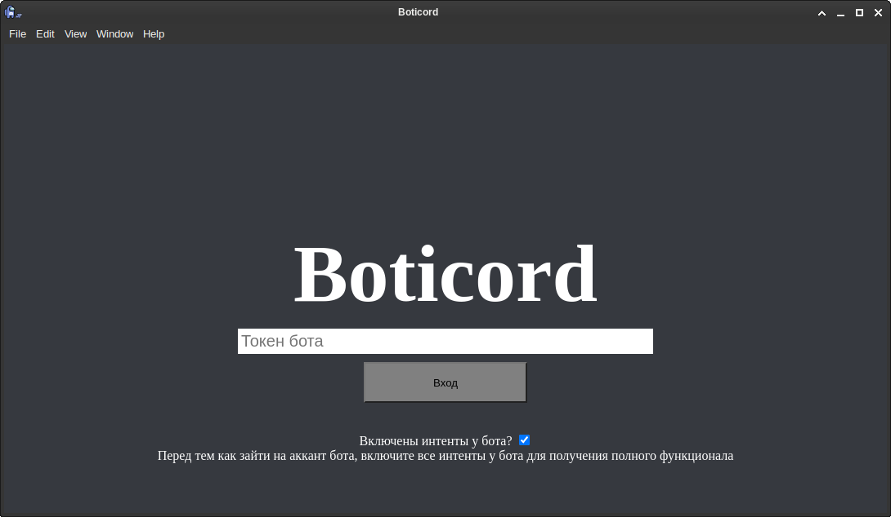
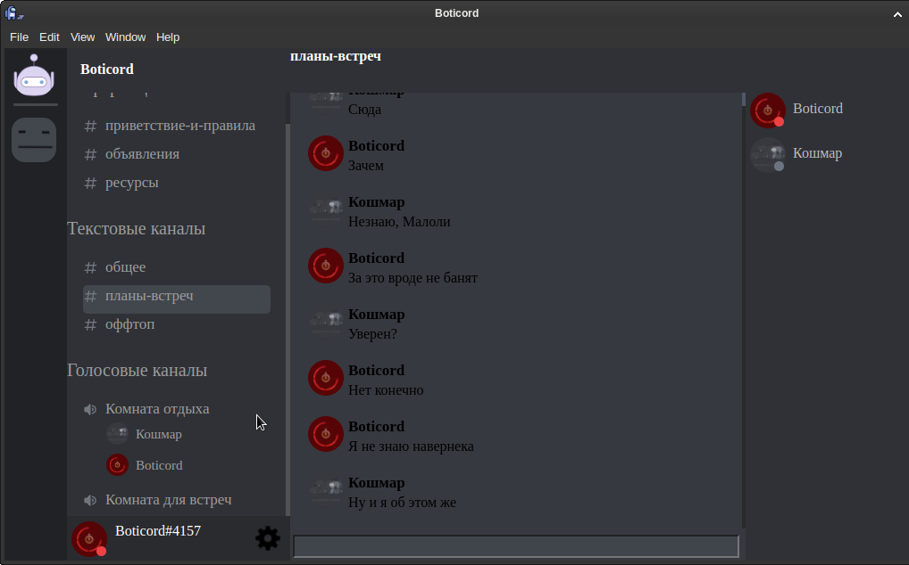
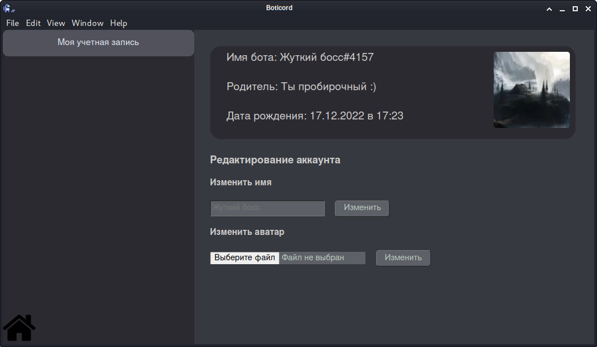
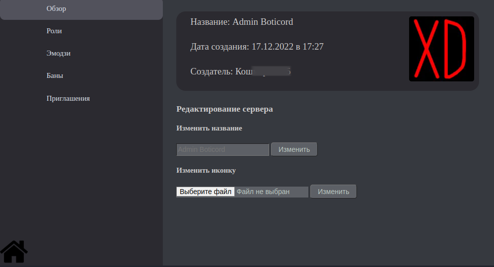
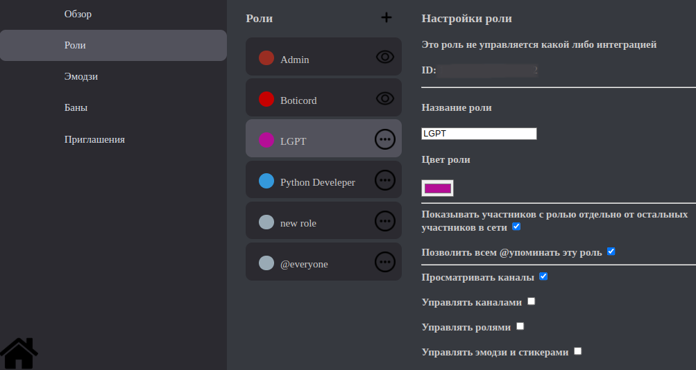

# Boticord
Данный софт служит для общения в дискорде через бота

### На данный момент вы можете:
- Общаться в чатах на серверах
- Просматривать участников сервера
- Писать личные сообщения пользователям
- Редактировать настройки бота
- Редактировать настройки серверов

### Так же планируется добавить:
- Общение в голосовых каналах
- Писание скриптов для бота
- Архив сообщений(общий аудит)

Так же можете предлагать свои идеи для улучшения **Boticord**!

# Установка
- Клонируем репозиторий: 
`git clone https://notabug.org/Ktoto/Boticord.git Boticord` 
- Переходим в каталог: 
`cd Boticord` 
- Скачиваем нужные библиотеки: 
`npm i`
- Запуск приложения: 
`npm start`

## Получение исполняемого файла
- Открываем файл **build.js** и редактируем его так, как сказано в комментариях файла
- И запускаем файл, для получение исполняемого файла: 
`node build.js`
- После окончания, в папке dist будет исполняемый файл под вашу OS

# Призентация
## Окно входа:

## Сам **Boticord**:

